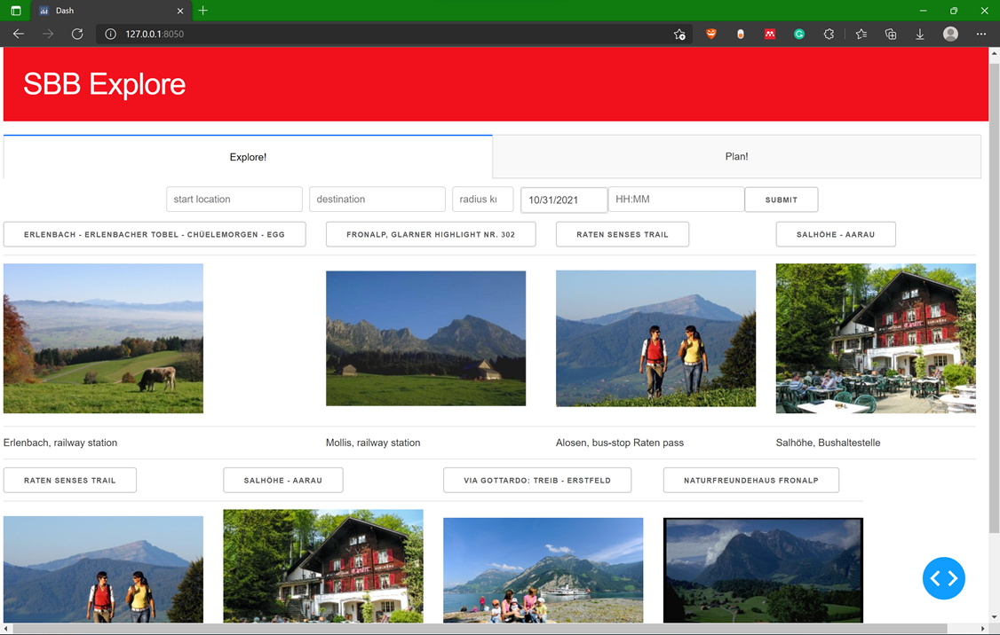
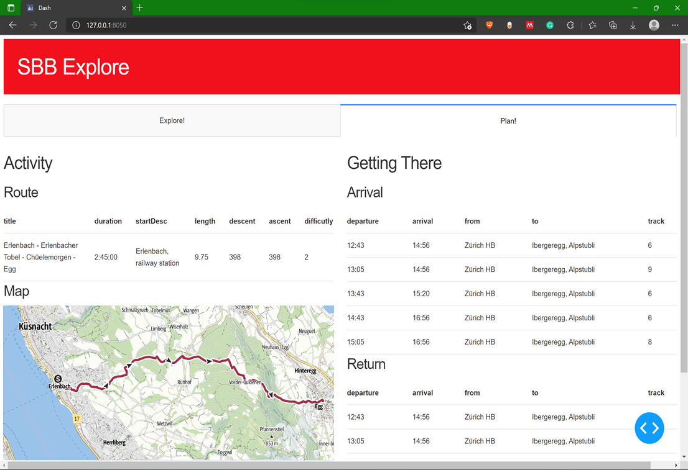

# polyHack2021_SBB
This small app is a concept for an conveniet travel Idea with SBB. 

## Convenience
All travel destinations are ranked by the traviling distance, the user rating, the last mile distance and the number of changes on the tracks.
With this ranking, the easy reachable destinations are suggested to the customer, allowing comfortable planning of outdoor activities.

###Exploration Phase:

The exploration tab offers the customer a nice overview over conveniently reachable destinations.
Subselections of regions in Switzerland and time scheduling are features, that makes exploring switzerland easy.

###Planning Phase:

The planning tab is visualizing information about the outdoor activity and the public transport connections.
This can easily be enhanced with the already present weather information and Points of interest.

### Having Fun!

## The Application

### Installing environment:

Here you can quickly install the required env with this command.
Requirements: python3, Anaconda

    conda env create -f condaEnv.yml

### Running the app
the App can be easily started, after installing our provided Anaconda environment.

    cd src/dash
    python index.py

## Authors
the code of this Application was written during the PolyHack Hackaton 2021 by:
Benjamin Ries, Alzbeta Kubincova, Marc Lehner
